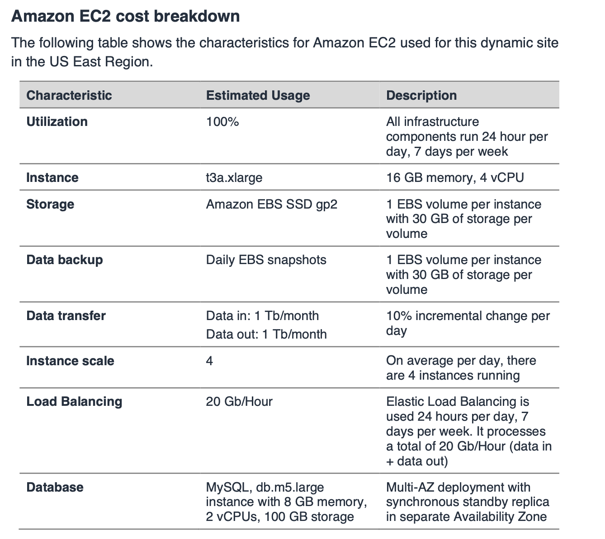
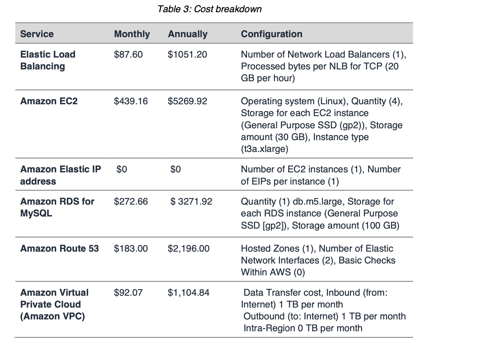

# Preparation Sources

AWS Pricing Overview
AWS Overview
AWS Certified Cloud Practioner Exam Guide

# Online Courses

AWS Certified Cloud Practitioner Course by Ryan Kroonenberg on Udemy/ A Cloud Guru

AWS Certified Cloud Practitioner: 6 Full Practice Exams 2020 by Mozdora Education

AWS Cloud Practitioner Essential from AWS Digital Training

# Appendix

## AWS Shared Responsibility Model : https://aws.amazon.com/compliance/shared-responsibility-model/

- AWS : Responsibility of the Cloud
- Customer: Responsibility in the Cloud

- Inherited Controls – Controls which a customer fully inherits from AWS.
  * Physical and Environmental controls

- Shared Controls – Controls which apply to both the infrastructure layer and customer layers, but in completely separate contexts or perspectives. In a shared control, AWS provides the requirements for the infrastructure and the customer must provide their own control implementation within their use of AWS services. Examples include:

 * Patch Management – AWS is responsible for patching and fixing flaws within the infrastructure, but customers are responsible for patching their guest OS and applications.
 * Configuration Management – AWS maintains the configuration of its infrastructure devices, but a customer is responsible for configuring their own guest operating systems, databases, and applications.
 * Awareness & Training - AWS trains AWS employees, but a customer must train their own employees.

-Customer Specific – Controls which are solely the responsibility of the customer based on the application they are deploying within AWS services. Examples include:

 * Service and Communications Protection or Zone Security which may require a customer to route or zone data within specific security environments.

## Seven Design Principles for Security in Cloud

1- Implement a strong identity foundation: Implement the principle of least privilege and enforce separation of duties with appropriate authorization for each interaction with your AWS resources. Centralize privilege management and reduce or even eliminate reliance on long-term credentials.

2- Enable traceability: Monitor, alert, and audit actions and changes to your environment in real time. Integrate logs and metrics with systems to automatically respond and take action.

3- Apply security at all layers: Rather than just focusing on protection of a single outer layer, apply a defense-in-depth approach with other security controls. Apply to all layers (e.g., edge network, VPC, subnet, load balancer, every instance, operating system, and application).

4- Automate security best practices: Automated software-based security mechanisms improve your ability to securely scale more rapidly and cost effectively. Create secure architectures, including the implementation of controls that are defined and managed as code in version-controlled templates.

5- Protect data in transit and at rest: Classify your data into sensitivity levels and use mechanisms, such as encryption, tokenization, and access control where appropriate.

6- Keep people away from data: Create mechanisms and tools to reduce or eliminate the need for direct access or manual processing of data. This reduces the risk of loss or modification and human error when handling sensitive data.

7- Prepare for security events: Prepare for an incident by having an incident management process that aligns to your organizational requirements. Run incident response simulations and use tools with automation to increase your speed for detection, investigation, and recovery.

## AWS Global Infrastructure

- An AWS Region is a physical location in the world where we have multiple Availability Zones. 

-  Availability Zones consist of one or more discrete data centers, each with redundant power, networking, and connectivity, housed in separate facilities.

Edge Location: A site that CloudFront uses to cache copies of your content for faster delivery to users at any location.

## Cloud Computing Benefits

6 advantages:

  - Trade capital expense for variable expense
  - Benefit from massive economies of scale
  - Stop guessing capacity 
  - Increase speed and agility
  - Stop spending money running and maintaining data centers
  - Go global in minutes

## AWS Security, Identity and Compliance

Benefits of AWS Security
• Keep Your Data Safe: The AWS infrastructure puts strong safeguards in place to help protect your privacy. All data is stored in highly secure AWS data centers.
• Meet Compliance Requirements: AWS manages dozens of compliance programs in its infrastructure. This means that segments of your compliance have already been completed.
• Save Money: Cut costs by using AWS data centers. Maintain the highest standard of security without having to manage your own facility
• Scale Quickly: Security scales with your AWS Cloud usage. No matter the size of your business, the AWS infrastructure is designed to keep your data safe.

## AWS Pricing Model

https://aws.amazon.com/pricing/

http://d1.awsstatic.com/whitepapers/aws_pricing_overview.pdf

AWS provides three pricing models:

1- Pay-as-you-go

2- Save when you reserve

3- Pay less by using more

- There are three fundamental drivers of cost with AWS: compute, storage, and outbound data transfer.

- AWS offers several pricing models depending on product. These include:
• On-Demand Instances let you pay for compute or database capacity by the hour or second (minimum of 60 seconds) depending on which instances you run with no long-term commitments or upfront payments.
• Savings Plans are a flexible pricing model that offer low prices on Amazon EC2, AWS Lambda and AWS Fargate usage, in exchange for a commitment to a consistent amount of usage (measured in $/hour) for a one- or three-year term.
• Spot Instances are an Amazon EC2 pricing mechanism that let you request spare computing capacity with no upfront commitment and at discounted hourly rate (up to 90% off the on-demand price).
• Reservations provide you with the ability to receive a greater discount, up to 75 percent, by paying for capacity ahead of time. For more details, see the Optimizing costs with reservations section.

### 12 Months Free

- Amazon Elastic Compute Cloud (Amazon EC2): 750 hours per month of Linux, RHEL, or SLES t2.micro/t3.micro instance usage or 750 hours per month of Windows t2.micro/t3.micro instance usage dependent on Region.

- Amazon Simple Storage Service (Amazon S3): 5 GB of Amazon S3 standard storage, 20,000 Get Requests, and 2,000 Put Requests.

- Amazon Relational Database Service (Amazon RDS): 750 hours of Amazon RDS Single-AZ db.t2.micro database usage for running MySQL, PostgreSQL, MariaDB, Oracle BYOL, or SQL Server (running SQL Server Express Edition); 20 GB of general purpose SSD database storage and 20 GB of storage for database backup and DB snapshots.

-  Amazon CloudFront: 50 GB Data Transfer Out and 2,000,000 HTTP and HTTPS Requests each month.

### Always Free

- Amazon DynamoDB: Up to 200 million requests per month (25 Write Capacity units and 25 Read Capacity units); 25 GB of storage.

-  Amazon S3 Glacier: Retrieve up to 10 GB of your Amazon S3 Glacier data per month for free (applies to standard retrievals using the Glacier API only).

- AWS Lambda: 1 million free requests per month; up to 3.2 million seconds of compute time per month.

### Trials

- Amazon SageMaker: 250 hours per month of t2.medium notebook,50 hours per month of m4.xlarge for training, 125 hours per month of m4.xlarge for hosting for the first two months.

- Amazon Redshift: 750 hours per month for free, enough hours to continuously run one DC2.Large node with 160GB of compressed SSD storage. You can also build clusters with multiple nodes to test larger data sets, which will consume your free hours more quickly. Once your two month free trial expires or your usage exceeds 750 hours per month, you can shut down your cluster to avoid any charges, or keep it running at the standard On-Demand Rate.

### Pricing/TCO Tools:

- AWS Pricing Calculator is a web based service that you can use to create cost estimates to suit your AWS use cases. AWS Pricing Calculator is useful both for people who have never used AWS and for those who want to reorganize or expand their usage.

- Migration Evaluator (Formerly TSO Logic) is a complimentary service to create data- driven business cases for AWS Cloud planning and migration.

- TCO Calculator (deprecated): The AWS TCO (Total Cost of Ownership) Calculator is a free tool that provides directional guidance on possible realized savings when deploying AWS

- AWS Simple Monthly Calculator helps customers estimate their monthly AWS bill based on their expected usage.

### Estimating Amazon EC2 costs

When you begin to estimate the cost of using Amazon EC2, consider the following:

• Clock hours of server time: Resources incur charges when they are running— for example, from the time Amazon EC2 instances are launched until they are terminated, or from the time Elastic IP addresses are allocated until the time they are de-allocated.

• Instance type: Amazon EC2 provides a wide selection of instance types optimized to fit different use cases. Instance types comprise varying combinations of CPU, memory, storage, and networking capacity and give you the flexibility to choose the appropriate mix of resources for your applications. Each instance type includes at least one instance size, allowing you to scale your resources to the requirements of your target workload.

• Pricing model: With On-Demand Instances, you pay for compute capacity by the hour with no required minimum commitments.

• Number of instances: You can provision multiple instances of your Amazon EC2 and Amazon EBS resources to handle peak loads.

• Load balancing: You can use Elastic Load Balancing to distribute traffic among Amazon EC2 Instances. The number of hours Elastic Load Balancing runs and the amount of data it processes contribute to the monthly cost.

• Detailed monitoring: You can use Amazon CloudWatch to monitor your EC2 instances. By default, basic monitoring is enabled. For a fixed monthly rate, you can opt for detailed monitoring, which includes seven preselected metrics recorded once a minute. Partial months are charged on an hourly pro rata basis, at a per instance-hour rate.

• Amazon EC2 Auto Scaling: Amazon EC2 Auto Scaling automatically adjusts the number of Amazon EC2 instances in your deployment according to the scaling policies you define. This service is available at no additional charge beyond Amazon CloudWatch fees.

• Elastic IP addresses: You can have one Elastic IP address associated with a running instance at no charge.

• Licensing: To run operating systems and applications on AWS, you can obtain variety of software licenses from AWS on a pay-as-you-go basis that are fully- compliant and do not require you to manage complex licensing terms and conditions. However, if you have existing licensing agreements with software vendors, you can bring your eligible licenses to the cloud to reduce total cost of ownership (TCO). AWS offers License Manager which makes it easier to manage your software licenses from vendors such as Microsoft, SAP, Oracle, and IBM across AWS and on-premises environments.

### AWS Lambda pricing

Request pricing
• Free Tier: 1 million requests per month, 400,000 GB-seconds of compute time per month
• $0.20 per 1 million requests thereafter, or $0.0000002 per request
Duration pricing
• 400,000 GB-seconds per month free, up to 3.2 million seconds of compute time
• $0.00001667 for every GB-second used thereafter

### Cloud Front Pricing

To estimate the costs of an Amazon CloudFront distribution consider the following:

- Data Transfer Out.

- Traffic distribution.

- Number of requests.
### AWS Pricing example

## AWS Support and Partners

https://aws.amazon.com/premiumsupport/plans/
https://aws.amazon.com/partners/

- Basic Support: Basic Support is included for all AWS customers and includes:
* Customer Service and Communities - 24x7 access to customer service, documentation, whitepapers, and support forums.
* AWS Trusted Advisor - Access to the 7 core Trusted Advisor checks and guidance to provision your resources following best practices to increase performance and improve security.
* AWS Personal Health Dashboard - A personalized view of the health of AWS services, and alerts when your resources are impacted.

- Developer Support: Recommended if you are experimenting or testing in AWS.

- Business Support: Recommended if you have production workloads in AWS.

- Enterprise Support: Recommended if you have business and/or mission critical workloads in AWS.

- AWS Infrastructure Event Management is a short-term engagement with AWS Support, included in the Enterprise-level Support product offering, and available for additional purchase for Business-level Support subscribers. AWS Infrastructure Event Management partners with your technical and project resources to gain a deep understanding of your use case and provide architectural and scaling guidance for an event. Common use-case examples for AWS Event Management include advertising launches, new product launches, and infrastructure migrations to AWS.

-  AWS Personal Health Dashboard provides alerts and remediation guidance when AWS is experiencing events that may impact you. While the Service Health Dashboard displays the general status of AWS services, Personal Health Dashboard gives you a personalized view into the performance and availability of the AWS services underlying your AWS resources.

-  AWS Support API provides access to some of the features of the AWS Support Center via an API.

- AWS Support Concierge Service assists customers with account and billing inquiries. Included as part of the Enterprise Support plan, the Support Concierge Team are AWS billing and account experts that specialize in working with enterprise accounts. The Concierge team will quickly and efficiently assist you with your billing and account inquiries, and work with you to help implement billing and account best practices so that you can focus on running your business.

- AWS Operations Support is an Enterprise support program that provides operations assessments and analysis to identify gaps across the operations lifecycle, as well as recommendations based on best practices.

-   The AWS Abuse team can assist you when AWS resources are being used to engage in the following types of abusive behavior: Spam, Port scanning, Denial of service attacks (DOS), Intrusion attempts: Your logs show that one or more AWS-owned IP addresses are being used to attempt to log in to your resources,  Hosting objectionable or copyrighted content, Distributing malware.

- AWS Security team is responsible for the security of services offered by AWS.

- The AWS Customer Service team is at the forefront of this transformational technology assisting a global list of customers that are taking advantage of a growing set of services and features to run their mission-critical applications. The team helps AWS customers understand what Cloud Computing is all about, and whether it can be useful for their business needs.

-  For Enterprise-level customers, a TAM (Technical Account Manager) provides technical expertise for the full range of AWS services and obtains a detailed understanding of your use case and technology architecture. TAMs work with AWS Solution Architects to help you launch new projects and give best practices recommendations throughout the implementation life cycle.

-  AWS Infrastructure Event Management (IEM) is a structured program available to Enterprise Support customers (and Business Support customers for an additional fee) that helps you plan for large-scale events such as product or application launches, infrastructure migrations, and marketing events. 

-  APN Consulting Partners are professional services firms that help customers design, architect, build, migrate, and manage their workloads and applications on AWS. Consulting Partners include System Integrators, Strategic Consultancies, Agencies, Managed Service Providers, and Value-Added Resellers.

- APN Technology Partners provide software solutions that are either hosted on, or integrated with, the AWS platform. APN Technology Partners include Independent Software Vendors (ISVs), SaaS, PaaS, Developer Tools, Management and Security Vendors.

-  AWS Professional Services shares a collection of offerings to help you achieve specific outcomes related to enterprise cloud adoption. AWS Professional Services also trains your team with specialized skills and provides global specialty practices to support your efforts in focused areas of enterprise cloud computing. The AWS Professional Services organization is a global team of experts that helps customers realize their desired business outcomes when using AWS.

- AWS Cloud Adoption Framework (AWS CAF) to help organizations design and travel an accelerated path to successful cloud adoption. 

## Cloud Computing Models

- Infrastructure as a Service (IaaS) contains the basic building blocks for cloud IT and typically provides access to networking features, computers (virtual or on dedicated hardware), and data storage space. IaaS provides you with the highest level of flexibility and management control over your IT resources and is most similar to existing IT resources that many IT departments and developers are familiar with today.

- Platform as a Service (PaaS) removes the need for your organization to manage the underlying infrastructure (usually hardware and operating systems) and allows you to focus on the deployment and management of your applications. This helps you be more efficient as you don’t need to worry about resource procurement, capacity planning, software maintenance, patching, or any of the other undifferentiated heavy lifting involved in running your application.

- Software as a Service (SaaS) provides you with a completed product that is run and managed by the service provider. In most cases, people referring to Software as a Service are referring to end-user applications. 

## Cloud Computing Deployment Models

- A cloud-based application is fully deployed in the cloud and all parts of the application run in the cloud. Applications in the cloud have either been created in the cloud or have been migrated from an existing infrastructure to take advantage of the benefits of cloud computing. Cloud-based applications can be built on low-level infrastructure pieces or can use higher level services that provide abstraction from the management, architecting, and scaling requirements of core infrastructure.

- A hybrid deployment is a way to connect infrastructure and applications between cloud-based resources and existing resources that are not located in the cloud. The most common method of hybrid deployment is between the cloud and existing on-premises infrastructure to extend, and grow, an organization's infrastructure into the cloud while connecting cloud resources to the internal system. For more information on how AWS can help you with your hybrid deployment, please visit our hybrid page.

- The deployment of resources on-premises, using virtualization and resource management tools, is sometimes called the “private cloud.” On-premises deployment doesn’t provide many of the benefits of cloud computing but is sometimes sought for its ability to provide dedicated resources. In most cases this deployment model is the same as legacy IT infrastructure while using application management and virtualization technologies to try and increase resource utilization.

## AWS Well Architected Framework

Operational Excellence Pillar: The operational excellence pillar focuses on running and monitoring systems to deliver business value, and continually improving processes and procedures. Key topics include automating changes, responding to events, and defining standards to manage daily operations.

Security Pillar : The security pillar focuses on protecting information and systems. Key topics include confidentiality and integrity of data, identifying and managing who can do what with privilege management, protecting systems, and establishing controls to detect security events.

Reliability Pillar : The reliability pillar focuses on ensuring a workload performs its intended function correctly and consistently when it’s expected to. A resilient workload quickly recovers from failures to meet business and customer demand. Key topics include distributed system design, recovery planning, and how to handle change.

Performance Efficiency PillarL The performance efficiency pillar focuses on using IT and computing resources efficiently. Key topics include selecting the right resource types and sizes based on workload requirements, monitoring performance, and making informed decisions to maintain efficiency as business needs evolve.

Cost Optimization Pillar: The cost optimization pillar focuses on avoiding unnecessary costs. Key topics include understanding and controlling where money is being spent, selecting the most appropriate and right number of resource types, analyzing spend over time, and scaling to meet business needs without overspending.

## AWS Services

### Analytics

 - AWS Athena (Serverless) :  interactive query service that makes it easy to analyze data in Amazon S3 using standard SQL. Athena is serverless, so there is no infrastructure to manage, and you pay only for the queries that you run. With Athena, there’s no need for complex extract, transform, and load (ETL) jobs to prepare your data for analysis. This makes it easy for anyone with SQL skills to quickly analyze large-scale datasets.

 - Amazon Elastic Map Reduce : provides a managed Hadoop framework that makes it easy, fast, and cost-effective to process vast amounts of data across dynamically scalable Amazon EC2 instances. You can also run other popular distributed frameworks such as Apache Spark, HBase, Presto, and Flink in Amazon EMR, and interact with data in other AWS data stores such as Amazon S3 and Amazon DynamoDB. EMR Notebooks, based on the popular Jupyter Notebook, provide a development and collaboration environment for ad hoc querying and exploratory analysis. Amazon EMR securely and reliably handles a broad set of big data use cases, including log analysis, web indexing, data transformations (ETL), machine learning, financial analysis, scientific simulation, and bioinformatics.

- Amazon CloudSearch: managed service in the AWS Cloud that makes it simple and cost-effective to set up, manage, and scale a search solution for your website or application. Amazon CloudSearch supports 34 languages and popular search features such as highlighting, autocomplete, and geospatial search.

- Amazon ElasticSearch service: makes it easy to deploy, secure, operate, and scale Elasticsearch to search, analyze, and visualize data in real-time. With Amazon Elasticsearch Service, you get easy-to-use APIs and real-time analytics capabilities to power use-cases such as log analytics, full-text search, application monitoring, and clickstream analytics, with enterprise-grade availability, scalability, and security. The service offers integrations with open- source tools like Kibana and Logstash for data ingestion and visualization.

- Amazon Kinesis makes it easy to collect, process, and analyze real-time, streaming data so you can get timely insights and react quickly to new information.  With Amazon Kinesis, you can ingest real-time data such as video, audio, application logs, website clickstreams, and IoT telemetry data for machine learning, analytics, and other applications. Amazon Kinesis currently offers four services: Kinesis Data Firehose, Kinesis Data Analytics, Kinesis Data Streams, and Kinesis Video Streams.

- Amazon Kinesis Data Firehose is the easiest way to reliably load streaming data into data stores and analytics tools. It can capture, transform, and load streaming data into Amazon S3, Amazon Redshift, Amazon Elasticsearch Service, and Splunk

- Amazon Kinesis Data Analytics is the easiest way to analyze streaming data, gain actionable insights, and respond to your business and customer needs in real time. 

- Amazon Kinesis Data Streams (KDS) is a massively scalable and durable real- time data streaming service. KDS can continuously capture gigabytes of data per second from hundreds of thousands of sources such as website clickstreams, database event streams, financial transactions, social media feeds, IT logs, and location-tracking events.

- Amazon Kinesis Video Streams makes it easy to securely stream video from connected devices to AWS for analytics, machine learning (ML), playback, and other processing. 

- Amazon Redshift is a fast, scalable data warehouse that makes it simple and cost-effective to analyze all your data across your data warehouse and data lake. Redshift delivers ten times faster performance than other data warehouses by using machine learning, massively parallel query execution, and columnar storage on high-performance disk.  You can setup and deploy a new data warehouse in minutes, and run queries across petabytes of data in your Redshift data warehouse, and exabytes of data in your data lake built on Amazon S3.

- Amazon QuickSight is a fast, cloud-powered business intelligence (BI) service that makes it easy for you to deliver insights to everyone in your organization.

- AWS Data Pipeline is a web service that helps you reliably process and move data between different AWS compute and storage services, as well as on- premises data sources, at specified intervals. With AWS Data Pipeline, you can regularly access your data where it’s stored, transform and process it at scale, and efficiently transfer the results to AWS services such as Amazon S3, Amazon RDS, Amazon DynamoDB, and Amazon EMR.

- AWS Glue is a fully managed extract, transform, and load (ETL) service that makes it easy for customers to prepare and load their data for analytics

- AWS Lake Formation is a service that makes it easy to set up a secure data lake in days. A data lake is a centralized, curated, and secured repository that stores all your data, both in its original form and prepared for analysis. 

- Amazon Managed Streaming for Kafka (Amazon MSK) is a fully managed service that makes it easy for you to build and run applications that use Apache Kafka to process streaming data.

### Application Integration

- AWS Step Functions lets you coordinate multiple AWS services into serverless workflows so you can build and update apps quickly.

- Amazon MQ is a managed message broker service for Apache ActiveMQ that makes it easy to set up and operate message brokers in the cloud. Message brokers allow different software systems–often using different programming languages, and on different platforms–to communicate and exchange information.

- Amazon Simple Queue Service (Amazon SQS) is a fully managed message queuing service that enables you to decouple and scale microservices, distributed systems, and serverless applications. 

- Amazon Simple Notification Service (Amazon SNS) is a highly available, durable, secure, fully managed pub/sub messaging service that enables you to decouple microservices, distributed systems, and serverless applications.

- Amazon Simple Workflow (Amazon SWF) helps developers build, run, and scale background jobs that have parallel or sequential steps.

### AR & VR 

- Amazon Sumerian lets you create and run virtual reality (VR), augmented reality (AR), and 3D applications quickly and easily without requiring any specialized programming or 3D graphics expertise.

### AWS Cost Management

- AWS Cost Explorer has an easy-to-use interface that lets you visualize, understand, and manage your AWS costs and usage over time. Get started quickly by creating custom reports (including charts and tabular data) that analyze cost and usage data, both at a high level (e.g., total costs and usage across all accounts) and for highly-specific requests (e.g., m2.2xlarge costs within account Y that are tagged “project: secretProject”).

- AWS Budgets gives you the ability to set custom budgets that alert you when your costs or usage exceed (or are forecasted to exceed) your budgeted amount.

- The AWS Cost & Usage Report is a single location for accessing comprehensive information about your AWS costs and usage. The AWS Cost & Usage Report lists AWS usage for each service category used by an account and its IAM users in hourly or daily line items, as well as any tags that you have activated for cost allocation purposes.

- AWS provides a number of RI-specific cost management solutions out-of-the- box to help you better understand and manage your RIs. Using the RI Utilization and Coverage reports available in AWS Cost Explorer, you can visualize your RI data at an aggregate level or inspect a particular RI subscription.

### Blockchain

- Amazon Managed Blockchain is a fully managed service that makes it easy to create and manage scalable blockchain networks using the popular open source frameworks Hyperledger Fabric and Ethereum.

### Business Applications

- Alexa for Business is a service that enables organizations and employees to use Alexa to get more work done. With Alexa for Business, employees can use Alexa as their intelligent assistant to be more productive in meeting rooms, at their desks, and even with the Alexa devices they already have at home.

- Amazon WorkDocs is a fully managed, secure enterprise storage and sharing service with strong administrative controls and feedback capabilities that improve user productivity.

- Amazon WorkMail is a secure, managed business email and calendar service with support for existing desktop and mobile email client applications. 

- Amazon Chime is a communications service that transforms online meetings with a secure, easy-to-use application that you can trust

### Compute

- Amazon Elastic Compute Cloud(IaaS) (Amazon EC2) is a web service that provides secure, resizable compute capacity in the cloud. It is designed to make web- scale computing easier for developers. Instance types: 
• On-Demand Instances—With On-Demand instances, you pay for compute capacity by the hour with no long-term commitments. 
• Reserved Instances—Reserved Instances provide you with a significant discount (up to 75%) compared to On-Demand instance pricing. (Types: Standard, Scheduled, Convertible)
• Spot Instances—Spot Instances are available at up to a 90% discount compared to On-Demand prices and let you take advantage of unused EC2 capacity in the AWS Cloud. (can be taken back by AWS at any time so the workloads will suffer downtime)

- Amazon EC2 Auto Scaling helps you maintain application availability and allows you to automatically add or remove EC2 instances according to conditions you define.

- Amazon Elastic Container Registry (Amazon ECR) is a fully-managed Docker container registry that makes it easy for developers to store, manage, and deploy Docker container images.

- Amazon Elastic Container Service (Amazon ECS) is a highly scalable, high- performance container orchestration service that supports Docker containers and allows you to easily run and scale containerized applications on AWS.

- Amazon Elastic Container Service for Kubernetes (Amazon EKS) makes it easy to deploy, manage, and scale containerized applications using Kubernetes on AWS.

- Amazon Lightsail is designed to be the easiest way to launch and manage a virtual private server with AWS. Lightsail plans include everything you need to jumpstart your project – a virtual machine, SSD- based storage, data transfer, DNS management, and a static IP address – for a low, predictable price.

- AWS Batch enables developers, scientists, and engineers to easily and efficiently run hundreds of thousands of batch computing jobs on AWS. 

- AWS Elastic Beanstalk (PaaS) is an easy-to-use service for deploying and scaling web applications and services developed with Java, .NET, PHP, Node.js, Python, Ruby, Go, and Docker on familiar servers such as Apache, Nginx, Passenger, and Internet Information Services (IIS).

- AWS Fargate (serverless) is a compute engine for Amazon ECS that allows you to run containers without having to manage servers or clusters. Amazon ECS has two modes: Fargate launch type (all you have to do is package your application in containers, specify the CPU and memory requirements, define networking and IAM policies, and launch the application) and EC2 launch type ( allows you to have server-level, more granular control over the infrastructure that runs your container applications). 

- AWS Lambda (Serverless) lets you run code without provisioning or managing servers. You pay only for the compute time you consume—there is no charge when your code is not running.

- The AWS Serverless Application Repository enables you to quickly deploy code samples, components, and complete applications for common use cases such as web and mobile back-ends, event and data processing, logging, monitoring, IoT, and more.

- AWS Outposts bring native AWS services, infrastructure, and operating models to virtually any data center, co-location space, or on-premises facility.

- VMware Cloud on AWS is an integrated cloud offering jointly developed by AWS and VMware delivering a highly scalable, secure and innovative service that allows organizations to seamlessly migrate and extend their on-premises VMware vSphere-based environments to the AWS Cloud running on next- generation Amazon Elastic Compute Cloud (Amazon EC2) bare metal infrastructure.

### Customer Engagement

- Amazon Connect is a self-service, cloud-based contact center service that makes it easy for any business to deliver better customer service at lower cost.

- Amazon Simple Email Service (Amazon SES) is a cloud-based email sending service designed to help digital marketers and application developers send marketing, notification, and transactional emails.

- Federation is an AWS feature that enables users to access and use AWS resources using their existing corporate credentials.

### Database

- Amazon Aurora is a MySQL and PostgreSQL compatible relational database engine that combines the speed and availability of high-end commercial databases with the simplicity and cost-effectiveness of open source databases. Amazon Aurora is up to five times faster than standard MySQL databases and three times faster than standard PostgreSQL databases. It provides the security, availability, and reliability of commercial databases at 1/10th the cost.

- Amazon Relational Database Service (Amazon RDS) makes it easy to set up, operate, and scale a relational database in the cloud. It provides cost-efficient and resizable capacity while automating time-consuming administration tasks such as hardware provisioning, database setup, patching and backups. 

- Amazon Relational Database Service (RDS) on VMware lets you deploy managed databases in on-premises VMware environments using the Amazon RDS technology enjoyed by hundreds of thousands of AWS customers.

- Amazon DynamoDB (Serverless) is a key-value and document database that delivers single- digit millisecond performance at any scale. It's a fully managed, multiregion, multimaster database with built-in security, backup and restore, and in-memory caching for internet-scale applications. DynamoDB Accelerator (DynamoDB DAX) is an in-memory cache for DynamoDB that reduces response times from milliseconds to microseconds.  DynamoDB point-in-time recovery (PITR) is used to back up your data with per-second granularity and restore to any single second from the time it was enabled up to the prior 35 days. DynamoDB PITR works as additional insurance against accidental loss of data.   DynamoDB global tables are ideal for massively scaled applications with globally dispersed users.

- Amazon ElastiCache is a web service that makes it easy to deploy, operate, and scale an in-memory cache in the cloud. Amazon ElastiCache supports two open-source in-memory caching engines: redis and memcached

- Amazon Neptune is a fast, reliable, fully-managed graph database service that makes it easy to build and run applications that work with highly connected datasets.

- Amazon QLDB is a fully managed ledger database that provides a transparent, immutable, and cryptographically verifiable transaction log owned by a central trusted authority.

- Amazon Timestream is a fast, scalable, fully managed time series database service for IoT and operational applications that makes it easy to store and analyze trillions of events per day at 1/10th the cost of relational databases.

- Amazon DocumentDB (with MongoDB compatibility) is a fast, scalable, highly available, and fully managed document database service that supports MongoDB workloads.

### Desktop and App Streaming

- Amazon WorkSpaces is a fully managed, secure cloud desktop service. You can use Amazon WorkSpaces to provision either Windows or Linux desktops in just a few minutes and quickly scale to provide thousands of desktops to workers across the globe.

- Amazon AppStream 2.0 is a fully managed application streaming service. You centrally manage your desktop applications on AppStream 2.0 and securely deliver them to any computer. 

### Developer Tools

- AWS CodeCommit is a fully-managed source control service that hosts secure Git-based repositories. It makes it easy for teams to collaborate on code in a secure and highly scalable ecosystem. CodeCommit eliminates the need to operate your own source control system or worry about scaling its infrastructure

- AWS CodeBuild is a fully managed build service that compiles source code, runs tests, and produces software packages that are ready to deploy. With CodeBuild, you don’t need to provision, manage, and scale your own build servers.

- AWS CodeDeploy is a service that automates code deployments to any instance, including EC2 instances and instances running on premises.

- AWS CodePipeline is a fully managed continuous delivery service that helps you automate your release pipelines for fast and reliable application and infrastructure updates.

- AWS CodeStar enables you to quickly develop, build, and deploy applications on AWS. AWS CodeStar provides a unified user interface, enabling you to easily manage your software development activities in one place

- Amazon Corretto is a no-cost, multiplatform, production-ready distribution of the Open Java Development Kit (OpenJDK).

- AWS Cloud9 is a cloud-based integrated development environment (IDE) that lets you write, run, and debug your code with just a browser. It includes a code editor, debugger, and terminal.Cloud9 comes prepackaged with essential tools for popular programming languages, including JavaScript, Python, PHP, and more.

- AWS X-Ray helps developers analyze and debug distributed applications in production or under development, such as those built using a microservices architecture.

### Game Tech

- Amazon GameLift is a managed service for deploying, operating, and scaling dedicated game servers for session-based multiplayer games. 

- Amazon Lumberyard is a free, cross-platform, 3D game engine for you to create the highest-quality games, connect your games to the vast compute and storage of the AWS Cloud, and engage fans on Twitch.

### IoT

- AWS IoT Core is a managed cloud service that lets connected devices easily and securely interact with cloud applications and other devices. 

- Amazon FreeRTOS (a:FreeRTOS) is an operating system for microcontrollers that makes small, low-power edge devices easy to program, deploy, secure, connect, and manage.

- AWS IoT Greengrass seamlessly extends AWS to devices so they can act locally on the data they generate, while still using the cloud for management, analytics, and durable storage.With AWS IoT Greengrass, connected devices can run AWS Lambda functions, execute predictions based on machine learning models, keep device data in sync, and communicate with other devices securely – even when not connected to the Internet.

- AWS IoT 1-Click is a service that enables simple devices to trigger AWS Lambda functions that can execute an action.

- AWS IoT Analytics is a fully-managed service that makes it easy to run and operationalize sophisticated analytics on massive volumes of IoT data without having to worry about the cost and complexity typically required to build an IoT analytics platform. 

- The AWS IoT Button is a programmable button based on the Amazon Dash Button hardware. This simple Wi-Fi device is easy to configure, and it’s designed for developers to get started with AWS IoT Core, AWS Lambda, Amazon DynamoDB, Amazon SNS, and many other Amazon Web Services without writing device-specific code.

- AWS IoT Device Defender is a fully managed service that helps you secure your fleet of IoT devices.

- AWS IoT Device Management makes it easy to securely onboard, organize, monitor, and remotely manage IoT devices at scale.

- AWS IoT Events is a fully managed IoT service that makes it easy to detect and respond to events from IoT sensors and applications.

- AWS IoT SiteWise is a managed service that makes it easy to collect and organize data from industrial equipment at scale. 

- AWS IoT Things Graph is a service that makes it easy to visually connect different devices and web services to build IoT applications.

- The AWS Partner Device Catalog helps you find devices and hardware to help you explore, build, and go to market with your IoT solutions. 

### Machine Learning

- Amazon SageMaker is a fully-managed platform that enables developers and data scientists to quickly and easily build, train, and deploy machine learning models at any scale.

- Amazon SageMaker Ground Truth helps you build highly accurate training datasets for machine learning quickly.

- Amazon Comprehend is a natural language processing (NLP) service that uses machine learning to find insights and relationships in text. No machine learning experience required.

- Amazon Lex is a service for building conversational interfaces into any application using voice and text. 

- Amazon Polly is an AI service that turns text into lifelike speech. Polly lets you create applications that talk, enabling you to build entirely new categories of speech-enabled products. 

- Amazon Rekognition is a service that makes it easy to add image analysis to your applications

- Amazon Translate is a neural machine translation service that delivers fast, high-quality, and affordable language translation. 

- Amazon Transcribe is an automatic speech recognition (ASR) service that makes it easy for developers to add speech-to-text capability to their applications.

- Amazon Elastic Inference allows you to attach low-cost GPU-powered acceleration to Amazon EC2 and Amazon SageMaker instances to reduce the cost of running deep learning inference by up to 75%.

- Amazon Forecast is a fully managed service that uses machine learning to deliver highly accurate forecasts.

- Amazon Textract is a service that automatically extracts text and data from scanned documents.

- Amazon Personalize is a machine learning service that makes it easy for developers to create individualized recommendations for customers using their applications.

- The AWS Deep Learning AMIs provide machine learning practitioners and researchers with the infrastructure and tools to accelerate deep learning in the cloud, at any scale.

- AWS DeepLens helps put deep learning in the hands of developers, literally, with a fully programmable video camera, tutorials, code, and pre-trained models designed to expand deep learning skills.

- AWS DeepRacer is a 1/18th scale race car which gives you an interesting and fun way to get started with reinforcement learning (RL).

- Apache MXNet on AWS is a fast and scalable training and inference framework with an easy-to-use, concise API for machine learning.

- TensorFlow on AWS enables developers to quickly and easily get started with deep learning in the cloud.

- AWS Inferentia is a machine learning inference chip designed to deliver high performance at low cost. 

### Management and Governance

- Amazon CloudWatch is a monitoring and management service built for developers, system operators, site reliability engineers (SRE), and IT
managers. CloudWatch provides you with data and actionable insights to monitor your applications, understand and respond to system-wide performance changes, optimize resource utilization, and get a unified view of operational health. CloudWatch collects monitoring and operational data in the form of logs, metrics, and events, providing you with a unified view of AWS resources, applications and services that run on AWS, and on-premises servers.You can use CloudWatch to set high resolution alarms, visualize logs and metrics side by side, take automated actions, troubleshoot issues, and discover insights to optimize your applications, and ensure they are running smoothly.

- AWS Auto Scaling monitors your applications and automatically adjusts capacity to maintain steady, predictable performance at the lowest possible cost. 

- AWS Control Tower automates the set-up of a baseline environment, or landing zone, that is a secure, well-architected multi-account AWS environment. 

-  AWS Systems Manager gives you visibility and control of your infrastructure on AWS. Systems Manager provides a unified user interface so you can view operational data from multiple AWS services and allows you to automate operational tasks across your AWS resources. AWS Systems Manager contains the following tools:
• Resource groups
• Insights Dashboard
• Run Command
• Inventory
• Maintenance Window
• Patch Manager
• Automation
• Parameter Store
• Session Manager
• Distributor

- AWS CloudFormation  gives developers and systems administrators an easy way to create and manage a collection of related AWS resources, provisioning and updating them in an orderly and predictable fashion.

- AWS CloudTrail is a web service that records AWS API calls for your account and delivers log files to you. The recorded information includes the identity of the API caller, the time of the API call, the source IP address of the API caller, the request parameters, and the response elements returned by the AWS service.The AWS API call history produced by CloudTrail enables security analysis, resource change tracking, and compliance auditing.

- AWS Config is a fully managed service that provides you with an AWS resource inventory, configuration history, and configuration change notifications to enable security and governance.

- AWS Config is a fully managed service that provides you with an AWS resource inventory, configuration history, and configuration change notifications to enable security and governance.

- AWS Service Catalog allows organizations to create and manage catalogs of IT services that are approved for use on AWS. 

-  AWS Trusted Advisor is an online resource to help you reduce cost, increase performance, and improve security by optimizing your AWS environment.

- AWS Personal Health Dashboard provides alerts and remediation guidance when AWS is experiencing events that might affect you. While the Service Health Dashboard displays the general status of AWS services, Personal Health Dashboard gives you a personalized view into the performance and availability of the AWS services underlying your AWS resources. 

- AWS Managed Services provides ongoing management of your AWS infrastructure so you can focus on your applications. AWS Managed Services automates common activities such as change requests, monitoring, patch management, security, and backup services, and provides full-lifecycle services to provision, run, and support your infrastructure. 

- The AWS Console Mobile Application lets customers view and manage a select set of resources to support incident response while on-the-go.

- AWS License Manager makes it easier to manage licenses in AWS and on- premises servers from software vendors such as Microsoft, SAP, Oracle, and IBM. 

- The AWS Well-Architected Tool helps you review the state of your workloads and compares them to the latest AWS architectural best practices. 

If you suspect that your account has been compromised, or if you have received a notification from AWS that the account has been compromised, perform the following tasks: 

1- Change your AWS root account password and the passwords of any IAM users. 

2- Delete or rotate all root and AWS Identity and Access Management (IAM) access keys.

3- Delete any potentially compromised IAM users.

4- Delete any resources on your account you didn’t create, such as EC2 instances and AMIs, EBS volumes and snapshots, and IAM users. 

5- Respond to any notifications you received from AWS Support through the AWS Support Center. 

-   The AWS Marketplace is a curated digital catalog that makes it easy for customers to find, buy, and immediately start using the software and services that customers need to build solutions and run their businesses. The AWS Marketplace provides value to buyers in several ways:

1- It simplifies software licensing and procurement with flexible pricing options and multiple deployment methods. Flexible pricing options include free trial, hourly, monthly, annual, multi-year, and BYOL.

2- Customers can quickly launch pre-configured software with just a few clicks, and choose software solutions in AMI and SaaS formats, as well as other formats.

3- It ensures that products are scanned periodically for known vulnerabilities, malware, default passwords, and other security-related concerns.

### Media Services

- Amazon Elastic Transcoder is media transcoding in the cloud. 

- AWS Elemental MediaConnect is a high-quality transport service for live video.

- AWS Elemental MediaConvert is a file-based video transcoding service with broadcast-grade features.

- AWS Elemental MediaLive is a broadcast-grade live video processing service.

- AWS Elemental MediaLive is a broadcast-grade live video processing service.

- AWS Elemental MediaStore is an AWS storage service optimized for media. 

- AWS Elemental MediaTailor lets video providers insert individually targeted advertising into their video streams without sacrificing broadcast-level quality-of- service. 

### Migration and Transfer

- AWS Migration Hub provides a single location to track the progress of application migrations across multiple AWS and partner solutions.

- AWS Application Discovery Service helps enterprise customers plan migration projects by gathering information about their on-premises data centers.The collected data is retained in encrypted format in an AWS Application Discovery Service data store. You can export this data as a CSV file and use it to estimate the Total Cost of Ownership (TCO) of running on AWS and to plan your migration to AWS. 

- AWS Database Migration Service helps you migrate databases to AWS easily and securely.The source database remains fully operational during the migration, minimizing downtime to applications that rely on the database. The AWS Database Migration Service can migrate your data to and from most widely used commercial and open-source databases. The service supports homogeneous migrations such as Oracle to Oracle, as well as heterogeneous migrations between different database platforms, such as Oracle to Amazon Aurora or Microsoft SQL Server to MySQL.

- AWS Server Migration Service: AWS Server Migration Service (SMS) is an agentless service which makes it easier and faster for you to migrate thousands of on-premises workloads to AWS.

- AWS Snowball is a petabyte-scale data transport solution that uses secure appliances to transfer large amounts of data into and out of AWS. 

- AWS Snowball Edge is a data migration and edge computing device that comes in two options. Snowball Edge Storage Optimized provides 100 TB of capacity and 24 vCPUs and is well suited for local storage and large scale data transfer. Snowball Edge Compute Optimized provides 52 vCPUs and an optional GPU for use cases such as advanced machine learning and full motion video analysis in disconnected environments.

- AWS Snowmobile is an exabyte-scale data transfer service used to move extremely large amounts of data to AWS

- AWS DataSync is a data transfer service that makes it easy for you to automate moving data between on-premises storage and Amazon S3 or Amazon Elastic File System (Amazon EFS). 

- AWS Transfer for SFTP is a fully managed service that enables the transfer of files directly into and out of Amazon S3 using the Secure File Transfer Protocol (SFTP)—also known as Secure Shell (SSH) File Transfer Protocol. 

### Mobile

- AWS Amplify makes it easy to create, configure, and implement scalable mobile applications powered by AWS.

- Amazon Cognito lets you add user sign-up, sign-in, and access control to your web and mobile apps quickly and easily. 

- Amazon Pinpoint makes it easy to send targeted messages to your customers through multiple engagement channels. 

- AWS Device Farm is an app testing service that lets you test and interact with your Android, iOS, and web apps on many devices at once, or reproduce issues on a device in real time.

- AWS AppSync is a serverless back-end for mobile, web, and enterprise applications. AWS AppSync makes it easy to build data driven mobile and web applications by handling securely all the application data management tasks like online and offline data access, data synchronization, and data manipulation across multiple data sources. AWS AppSync uses GraphQL, an API query language designed to build client applications by providing an intuitive and flexible syntax for describing their data requirement.

### Networking and Content Delivery

- Amazon Virtual Private Cloud (Amazon VPC) lets you provision a logically isolated section of the AWS Cloud where you can launch AWS resources in a virtual network that you define. 

- Amazon CloudFront is a fast content delivery network (CDN) service that securely delivers data, videos, applications, and APIs to customers globally with low latency, high transfer speeds, all within a developer-friendly environment using Edge Locations.

- Amazon Route 53 is a highly available and scalable cloud Domain Name System (DNS) web service. AWS—such as EC2 instances, Elastic Load Balancing load balancers, or Amazon S3 buckets—and can also be used to route users to infrastructure outside of AWS. 

- AWS PrivateLink simplifies the security of data shared with cloud-based applications by eliminating the exposure of data to the public Internet. 

- AWS Direct Connect makes it easy to establish a dedicated network connection from your premises to AWS. 

- AWS Global Accelerator is a networking service that improves the availability and performance of the applications that you offer to your global users.

- Amazon API Gateway is a fully managed service that makes it easy for developers to create, publish, maintain, monitor, and secure APIs at any scale.

- AWS Transit Gateway is a service that enables customers to connect their Amazon Virtual Private Clouds (VPCs) and their on-premises networks to a single gateway.

- AWS App Mesh makes it easy to monitor and control microservices running on AWS.

- AWS Cloud Map is a cloud resource discovery service. With Cloud Map, you can define custom names for your application resources, and it maintains the updated location of these dynamically changing resources. 

- Elastic Load Balancing (ELB) automatically distributes incoming application traffic across multiple targets, such as Amazon EC2 instances, containers, and IP addresses. Types of Load Balancers:

• Application Load Balancer is best suited for load balancing of HTTP and HTTPS traffic and provides advanced request routing targeted at the delivery of modern application architectures, including microservices and containers. Operating at the individual request level (Layer 7), Application Load Balancer routes traffic to targets within Amazon Virtual Private Cloud (Amazon VPC) based on the content of the request.

• Network Load Balancer is best suited for load balancing of TCP traffic where extreme performance is required. Operating at the connection level (Layer 4), Network Load Balancer routes traffic to targets within Amazon Virtual Private Cloud (Amazon VPC) and is capable of handling millions of requests per second while maintaining ultra-low latencies. Network Load Balancer is also optimized to handle sudden and volatile traffic patterns.

• Classic Load Balancer provides basic load balancing across multiple Amazon EC2 instances and operates at both the request level and connection level. Classic Load Balancer is intended for applications that were built within the EC2-Classic network.

### Robotics

- AWS RoboMaker is a service that makes it easy to develop, test, and deploy intelligent robotics applications at scale.

### Satellites

- AWS Ground Station is a fully managed service that lets you control satellite communications, downlink and process satellite data, and scale your satellite operations quickly, easily and cost-effectively without having to worry about building or managing your own ground station infrastructure.

### Security, Identity, and Compliance

- AWS Security Hub gives you a comprehensive view of your high-priority security alerts and compliance status across AWS accounts.  With Security Hub, you now have a single place that aggregates, organizes, and prioritizes your security alerts, or findings, from multiple AWS services, such as Amazon GuardDuty, Amazon Inspector, and Amazon Macie, as well as from AWS Partner solutions.

- Amazon Cloud Directory enables you to build flexible, cloud-native directories for organizing hierarchies of data along multiple dimensions. With Cloud Directory, you can create directories for a variety of use cases, such as organizational charts, course catalogs, and device registries.

- AWS Identity and Access Management (IAM) enables you to securely control access to AWS services and resources for your users and also:
• Manage IAM users and their access: You can create users in IAM, assign them individual security credentials (access keys, passwords, and multi-factor authentication devices), or request temporary security credentials to provide users access to AWS services and resources. You can manage permissions in order to control which operations a user can perform.
• Manage IAM roles and their permissions: You can create roles in IAM and manage permissions to control which operations can be performed by the entity, or AWS service, that assumes the role. You can also define which entity is allowed to assume the role.
• Manage federated users and their permissions: You can enable identity federation to allow existing identities (users, groups, and roles) in your enterprise to access the AWS Management Console, call AWS APIs, and access resources, without the need to create an IAM user for each identity.

- Amazon GuardDuty is a threat detection service that continuously monitors for malicious or unauthorized behavior to help you protect your AWS accounts and workloads.

- Amazon Inspector is an automated security assessment service that helps improve the security and compliance of applications deployed on AWS. Amazon Inspector automatically assesses applications for exposure, vulnerabilities, and deviations from best practices.

- Amazon Macie is a security service that uses machine learning to automatically discover, classify, and protect sensitive data in AWS. 

- AWS Artifact is your go-to, central resource for compliance-related information that matters to you. It provides on-demand access to AWS’ security and compliance reports and select online agreements. 

- AWS Certificate Manager is a service that lets you easily provision, manage, and deploy Secure Sockets Layer/Transport Layer Security (SSL/TLS) certificates for use with AWS services and your internal connected resources.

- AWS CloudHSM is a cloud-based hardware security module (HSM) that enables you to easily generate and use your own encryption keys on the AWS Cloud. 

- AWS Directory Service for Microsoft Active Directory, also known as AWS Managed Microsoft AD, enables your directory-aware workloads and AWS resources to use managed Active Directory in the AWS Cloud

- AWS Firewall Manager is a security management service that makes it easier to centrally configure and manage AWS WAF rules across your accounts and applications. 

- AWS Key Management Service (KMS) makes it easy for you to create and manage keys and control the use of encryption across a wide range of AWS services and in your applications.

- AWS Organizations offers policy-based management for multiple AWS accounts. Using AWS Organizations, you can create Service Control Policies (SCPs). Helps recieve volume discounts on all accounts under the organization. AWS Organizations has five main benefits:

1) Centrally manage access polices across multiple AWS accounts.

2) Automate AWS account creation and management.

3) Control access to AWS services.

4) Consolidate billing across multiple AWS accounts.

5) Configure AWS services across multiple accounts.

- AWS Secrets Manager helps you protect secrets needed to access your applications, services, and IT resources.

- AWS Shield is a managed Distributed Denial of Service (DDoS) protection service that safeguards web applications running on AWS. 

- AWS Single Sign-On (SSO) is a cloud SSO service that makes it easy to centrally manage SSO access to multiple AWS accounts and business applications. 

- AWS WAF is a web application firewall that helps protect your web applications from common web exploits that could affect application availability, compromise security, or consume excessive resources. 

### Storage

- Amazon Simple Storage Service (Amazon S3) is an object storage service that offers industry-leading scalability, data availability, security, and performance. Types: S3-Standard, S3-Standard-IA(Infrequently Accessed), S3-OneZone-IA, S3 Intelligent Tiering (if accessed in 30 days, moves to S3-Standard else S3-Standard-IA)

- Amazon Elastic File System (Amazon EFS) (regional service) provides a simple, scalable, elastic file system for Linux-based workloads for use with AWS Cloud services and on- premises resources. It is built to scale on demand to petabytes without disrupting applications, growing and shrinking automatically as you add and remove files.

- Amazon FSx for Lustre is a fully managed file system that is optimized for compute-intensive workloads, such as high performance computing, machine learning, and media data processing workflows.

- Amazon FSx for Windows File Server provides a fully managed native Microsoft Windows file system so you can easily move your Windows-based applications that require file storage to AWS.

- Amazon S3 Glacier is a secure, durable, and extremely low-cost storage service for data archiving and long-term backup. (for active archives, lon term analytics, takes from min to hours for retrieval, lowest cost compared to s3 options). Amazon S3 Glacier Deep Archive (cheaper alternative, but takes upto 12 hours for retrieval)

- AWS Storage Gateway is a hybrid storage service that enables your on- premises applications to seamlessly use AWS cloud storage. 

 

